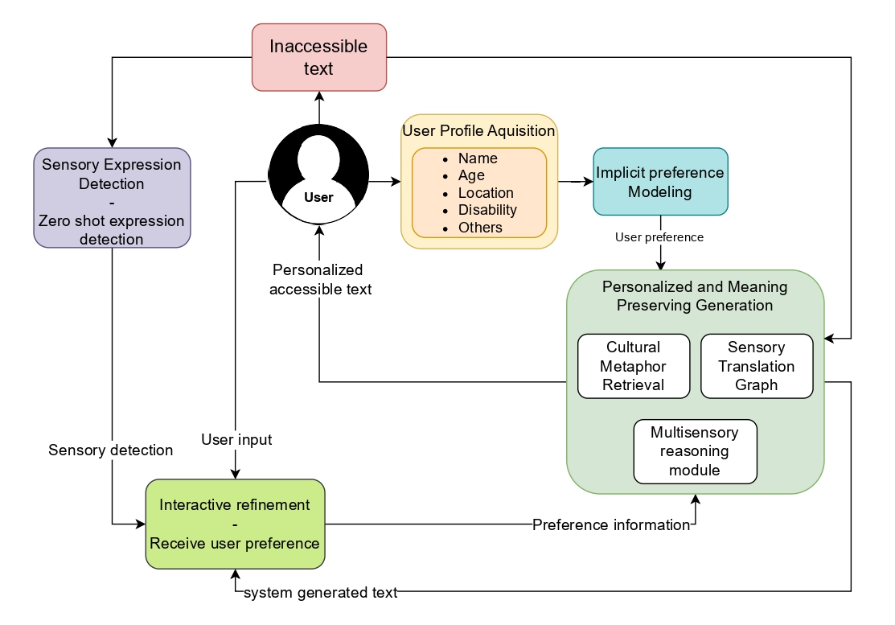

# 🎯 SenseAble - Personalized Text Accessibility

An intelligent text rephrasing tool that adapts content based on individual accessibility needs.

## ✨ Features

- Smart text analysis with phrase tagging
- Gentle & Full rewrites
- Custom chat instructions
- Accessibility-based color palettes
- Interactive suggestions (Accept/Ignore)
- Iterative refinement workflow

## 🗺️ Flowchart

